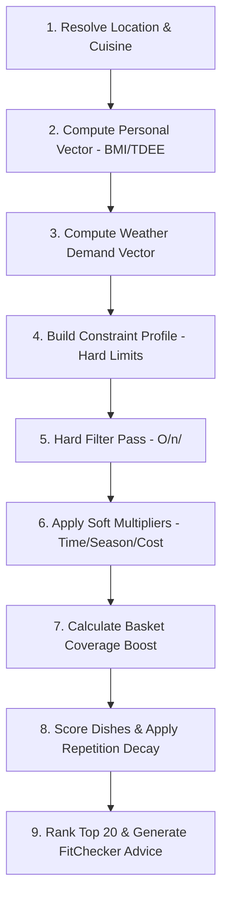

# 🥗 Daily Mate — Demo Server (Backend REST API)

[](https://www.python.org/)
[](https://flask.palletsprojects.com/)
[](https://github.com/)
[](https://supabase.com/)
[](https://firebase.google.com/)

**Daily Mate** là backend REST API phục vụ ứng dụng gợi ý món ăn thông minh dành cho người dùng Việt Nam. Hệ thống tự động đề xuất các món ăn tối ưu cá nhân hóa dựa trên **thời tiết thực tế theo GPS**, **thể trạng sức khỏe & bệnh lý**, **nguyên liệu sẵn có trong tủ lạnh (Basket Boost)**, **khẩu vị** và **vùng miền ẩm thực (63 tỉnh/thành)**.

---

## 📋 Mục lục

- [Tổng quan & Tính năng chính](#-tổng-quan--tính-năng-chính)
- [Kiến trúc hệ thống](#-kiến-trúc-hệ-thống)
- [Quy trình Gợi ý (9-Step Pipeline)](#-quy-trình-gợi-ý-9-step-pipeline)
- [Cấu trúc Thư mục](#-cấu-trúc-thư-mục)
- [Danh sách API Endpoints](#-danh-sách-api-endpoints)
- [Cài đặt & Khởi chạy](#-cài-đặt--khởi-chạy)
- [Kiểm thử (Automated Tests)](#-kiểm-thử-automated-tests)
- [Đánh giá Dự án & Hướng phát triển](#-đánh-giá-dự-án--hướng-phát-triển)

---

## 🚀 Tổng quan & Tính năng chính

### 1. 🌤️ Weather-Aware Recommendation (Nhận thức Thời tiết)
- Tích hợp **OpenWeatherMap API** lấy nhiệt độ, độ ẩm, tốc độ gió, chỉ số chất lượng không khí (AQI).
- Quy đổi dữ liệu thời tiết thực thành 6 chỉ số sinh lý: `heat_stress`, `dehydration_risk`, `cold_stress`, `oxidative_stress`, `infection_risk`, `immune_load`.
- Cơ chế **Adaptive TTL Cache**: Tự động rút ngắn thời gian cache (15–60 phút) khi thời tiết khắc nghiệt (AQI > 150, nhiệt độ > 40°C, gió > 50km/h).

### 2. 🩺 Health & Pathology Filtering (Bảo vệ Sức khỏe & Lọc Bệnh lý)
- **Ràng buộc cứng (Hard Filter):**
  - **Tăng huyết áp:** Giới hạn Sodium $\le 600\text{mg/serving}$.
  - **Tiểu đường:** Giới hạn Glycemic Load $\text{GL} \le 10$.
  - **Bệnh Gout:** Lọc món có `gout_risk_score < 0.3`.
- **Lọc Dị ứng (Allergens):** Loại trừ chính xác theo ID hoặc nhóm (Hải sản, Thịt, Sữa, Trứng, Hạt, Gluten, Đậu nành, Heo, Cá, Giáp xác, Lúa mì).
- **Chế độ ăn (Diet):** Vegan, Vegetarian, Omnivore.
- **Thời gian chế biến (Max Prep Time):** Lọc món vượt ngưỡng thời gian quy định.

### 3. 🥦 Market Basket Optimization (Ưu tiên Tủ lạnh - Basket Boost)
- Ưu tiên tăng điểm (`boost`) cho các món ăn sử dụng $\ge 40\%$ nguyên liệu người dùng đang có sẵn.
- **Loại trừ thông minh các gia vị & đồ gia dụng (Pantry items):** Không tính điểm trùng lặp cho muối, mắm, dầu ăn, trứng, gạo...

### 4. 💬 Context-Aware Explanation Engine (Advice Engine)
- Sinh câu giải thích tiếng Việt tự nhiên cho từng gợi ý theo 7 chiều thông tin (*Headline, Weather reason, Dish match, Nutrition note, Ingredient note, Seasonal note, Tags*).
- Sử dụng thuật toán **FitChecker**: Chỉ tạo lý do khi chỉ số món ăn thực sự đạt ngưỡng vượt trội, loại bỏ tình trạng bịa lý do ("hallucination").

### 5. 🔔 Push Notification & Daily Challenge
- Gửi thông báo đẩy qua **FCM (Firebase Cloud Messaging)** tích hợp **APScheduler** cho các khung giờ ăn (sáng, trưa, tối).
- Món ăn thử thách trong ngày (**Daily Challenge**) sinh ngẫu nhiên có trọng số (Seeded MD5 Hash cố định theo ngày + GPS).

---

## 🏗️ Kiến trúc Hệ thống

Daily Mate Server xây dựng theo kiến trúc **Monolithic Flask REST API**, sử dụng **In-Memory JSON DataStore** giúp tối ưu tốc độ phản hồi cực nhanh (trung bình $< 50\text{ms}$).

```
┌─────────────────────────────────────────────────────────────┐
│                    CLIENT (Mobile / Web App)                │
└──────────────────────────────┬──────────────────────────────┘
                               │ HTTPS + Supabase JWT Bearer Token
                               ▼
┌─────────────────────────────────────────────────────────────┐
│                 FLASK REST API (app.py)                     │
│  ┌─────────────────┐   ┌────────────────┐   ┌─────────────┐ │
│  │ Auth Middleware │   │ Rate Limiter   │   │ Monitoring  │ │
│  │ (auth_middleware)   │ (rate_limiter) │   │(monitoring) │ │
│  └─────────────────┘   └────────────────┘   └─────────────┘ │
│                                                             │
│  ┌───────────────────────────────────────────────────────┐  │
│  │          RECOMMENDATION PIPELINE (pipeline.py)        │  │
│  │  Location → Personal → Demand → Constraint            │  │
│  │  → Filter → SoftMult → BasketBoost → Score → Explain  │  │
│  └───────────────────────────────────────────────────────┘  │
│                                                             │
│  ┌─────────────────────┐       ┌─────────────────────────┐  │
│  │     weather.py      │       │     advice_engine.py    │  │
│  │  (OpenWeather API)  │       │  (Explanation Builder)  │  │
│  └─────────────────────┘       └─────────────────────────┘  │
└──────────────┬─────────────────────────────┬────────────────┘
               │                             │
               ▼                             ▼
┌──────────────────────────────┐ ┌───────────────────────────┐
│     data_store.py (JSON)     │ │   Supabase Cloud Server   │
│  - dishes.json               │ │  - Request Telemetry Log  │
│  - ingredients.json          │ │  - User Session Feedback  │
│  - dish_ingredients.json     │ │  - JWKS / Auth Validation │
│  - provinces.json (63 tỉnh)  │ └───────────────────────────┘
│  - advice_templates.json     │
└──────────────────────────────┘
```

---

## 🔄 Quy trình Gợi ý (9-Step Pipeline)



---

## 📁 Cấu trúc Thư mục

```
demo_server/
├── app.py                      # REST API Entry Point & Routes
├── pipeline.py                 # Core Recommendation Engine (9 Steps)
├── advice_engine.py            # Explanation Builder & FitChecker
├── weather.py                  # OpenWeatherMap API & Vector Calculation
├── data_store.py               # In-Memory Data Access Layer (JSON Lookup)
├── auth_middleware.py          # Supabase JWT (ES256/HS256) Verification
├── rate_limiter.py             # Token Bucket Rate Limiter
├── monitoring.py               # Request Telemetry & Supabase Logging
├── fcm_service.py              # Firebase Push Notification Service
├── notification_scheduler.py   # APScheduler Job Scheduler
├── cache_manager.py            # Dynamic Adaptive Weather Cache Manager
├── requirements.txt            # Python Dependencies
├── Procfile                    # Deployment Configuration (Gunicorn)
├── run_tests.py                # 44 Automated Integration Test Cases
├── data/                       # Datasets dạng JSON
│   ├── dishes.json             # Danh mục món ăn & chỉ số dinh dưỡng
│   ├── ingredients.json        # Danh mục nguyên liệu
│   ├── dish_ingredients.json   # Định lượng nguyên liệu theo món
│   ├── provinces.json          # Tọa độ & thông tin 63 tỉnh thành
│   └── advice_templates.json   # Mẫu câu giải thích theo bối cảnh
└── docs/                       # Tài liệu thiết kế & kiến trúc chi tiết
    ├── 01_project_overview.md  # Tổng quan dự án
    ├── 02_architecture.md      # Chi tiết kiến trúc hệ thống
    └── 03_push_notification_fcm.md # Hướng dẫn cấu hình FCM Push
```

---

## 🌐 Danh sách API Endpoints

| HTTP Method | Endpoint | Xác thực (Auth) | Mô tả |
| :--- | :--- | :--- | :--- |
| `GET` | `/health` | Không | Healthcheck server & thống kê DataStore |
| `GET` | `/api/weather` | Bearer JWT | Lấy dữ liệu & vector thời tiết hiện tại theo GPS |
| `POST` | `/api/v1/recommend` | Bearer JWT + RateLimit | **Endpoint chính:** Gợi ý danh sách món ăn cá nhân hóa |
| `POST` | `/api/v1/feedback` | Bearer JWT | Gửi phản hồi người dùng (`eaten`, `skipped`, `rated`) |
| `GET` | `/api/v1/challenge` | Không | Lấy "Món thử thách trong ngày" |
| `GET` | `/api/v1/dishes` | Không | Danh sách món ăn (có hỗ trợ phân trang) |
| `GET` | `/api/v1/dishes/<id>` | Không | Chi tiết món ăn & danh sách nguyên liệu |
| `GET` | `/api/v1/ingredients` | Không | Danh sách nguyên liệu |
| `GET` | `/api/v1/locations` | Không | Danh sách 63 tỉnh/thành Việt Nam |
| `POST` | `/api/v1/weather/simulate` | Không | Mô phỏng weather vector (phục vụ Dev/Testing) |
| `POST` | `/api/v1/pipeline/debug` | Không | Inspect các bước xử lý pipeline (Dev) |
| `GET` | `/admin/stats` | Admin JWT | Xem thống kê số lượng request trong ngày |

---

## 🛠️ Cài đặt & Khởi chạy

### 1. Yêu cầu môi trường
- Python 3.12 trở lên
- pip & venv

### 2. Cài đặt Dependencies
```bash
# Tạo và kích hoạt môi trường ảo (Virtualenv)
python -m venv venv
# On Windows:
venv\Scripts\activate
# On Linux/macOS:
source venv/bin/activate

# Cài đặt các thư viện cần thiết
pip install -r requirements.txt
```

### 3. Cấu hình Biến môi trường (`.env`)
Tạo file `.env` tại thư mục gốc của dự án:
```env
PORT=5001
FLASK_ENV=development
OPENWEATHER_API_KEY=your_openweather_api_key
SUPABASE_URL=https://your-project.supabase.co
SUPABASE_SERVICE_ROLE_KEY=your_supabase_service_role_key
FCM_SERVER_KEY=your_fcm_server_key
```

### 4. Khởi chạy Server
```bash
# Khởi chạy ở chế độ Development:
python app.py

# Khởi chạy với Gunicorn (Production):
gunicorn --bind 0.0.0.0:5001 app:app
```
Server sẽ chạy mặc định tại: `http://localhost:5001`

---

## 🧪 Kiểm thử (Automated Tests)

Hệ thống đi kèm bộ kiểm thử tự động gồm **44 test cases** đa dạng kịch bản (thời tiết nắng nóng/giá lạnh, bệnh nhân tiểu đường/tăng huyết áp, dị ứng hải sản, v.v.).

### Cách chạy test:
1. Đảm bảo server đang chạy tại `http://localhost:5001`
2. Mở một terminal mới và chạy:
```bash
python run_tests.py
```
Kết quả kiểm thử chi tiết sẽ được xuất ra file `test_results.csv`.

---

## 📊 Đánh giá Dự án & Hướng phát triển

### 🌟 Ưu điểm nổi bật (Strengths)
1. **Tính Việt hóa cao:** Thiết kế chuyên biệt cho văn hóa ẩm thực Việt Nam (63 tỉnh thành, nguyên liệu địa phương, món ăn truyền thống).
2. **Thuật toán đa chiều chuẩn xác:** Kết hợp hài hòa giữa Y học/Dinh dưỡng + Khí tượng + Tủ lạnh cá nhân.
3. **Tốc độ xử lý ấn tượng:** Chuyển đổi dữ liệu sang `data_store.py` (In-memory JSON) giúp giảm latency truy vấn xuống mức tiệm cận $0\text{ms}$.
4. **Không bịa lý do (Zero-hallucination Engine):** Thuật toán `FitChecker` bảo đảm mọi câu giải thích đều có cơ sở dữ liệu thực tế.
5. **Bảo mật & Chuẩn hóa API:** Tích hợp Supabase Auth JWT, CORS security, Security Headers (`nosniff`, `DENY`), và Rate Limiting.

### ⚠️ Hạn chế hiện tại (Current Limitations)
1. **State In-Memory:** Rate limiter và cache thời tiết lưu trong bộ nhớ máy chủ, chưa hỗ trợ scale-out ngang (Load balancing nhiều instance).
2. **Rule-based Scoring:** Thuật toán scoring dựa trên trọng số cố định, chưa có module Machine Learning tự điều chỉnh theo lịch sử thói quen dài hạn.

### 🔮 Hướng phát triển tương lai (Roadmap)
- [ ] **Redis Layer:** Đưa Weather Cache & Rate Limiting lên Redis để sẵn sàng scale horizontal cluster.
- [ ] **AI Polish Integration:** Kích hoạt module `ai_polish.py` (sử dụng Groq API) để diễn đạt câu văn tự nhiên hơn nữa.
- [ ] **Feedback Learning Loop:** Xây dựng mô hình Collaborative Filtering hoặc Contextual Bandits dựa trên dữ liệu `session_feedback`.

---

<sub>© 2026 Daily Mate Team. All rights reserved.</sub>
